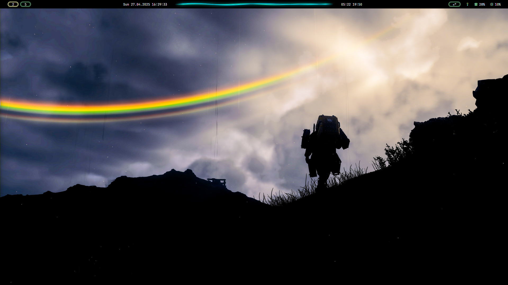
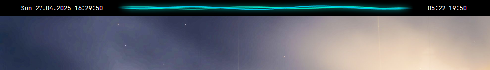

# zebar_audio_visualizer

## Hi, welcome to my Zebar profile!

This is my custom [Zebar](https://github.com/glzr-io/zebar) profile with a Death Stranding-style audio visualizer.

## Add you location coordinates

In the `basic.html` file there are two variables responsible for fetching sunrise and sunset time:
`const lat = 40.70;
const lon = -74.00;`
By default they are set the New York's location.
Feel free to check your location coordinates for example [here](https://www.latlong.net/) and update the vatiables.

## Important!

Zebar can't access your computer's live audio, but it can access the microphone.
Therefore, a simple workaround is needed:
1. Run **Win+R** and than `mmsys.cpl`.
2. Go into the **Recording** tab.
3. Right click on the **Stereo Mix** and turn it on.

That's it! Now Zebar will fetch your computer's live audio.
Note: Stereo Mix only works when you're outputting to an analog device (like a headphone or speaker jack, not HDMI).

The wallpaper comes from [Kojima Productions Death Stranding Year-Round Photo Mode Campaign December](https://kojimaproductions.jp/en/DSPhotomodeCP_Dec).
The creator is [Ari from X](https://x.com/VrPhotoGamess/status/1742876835761856579).
